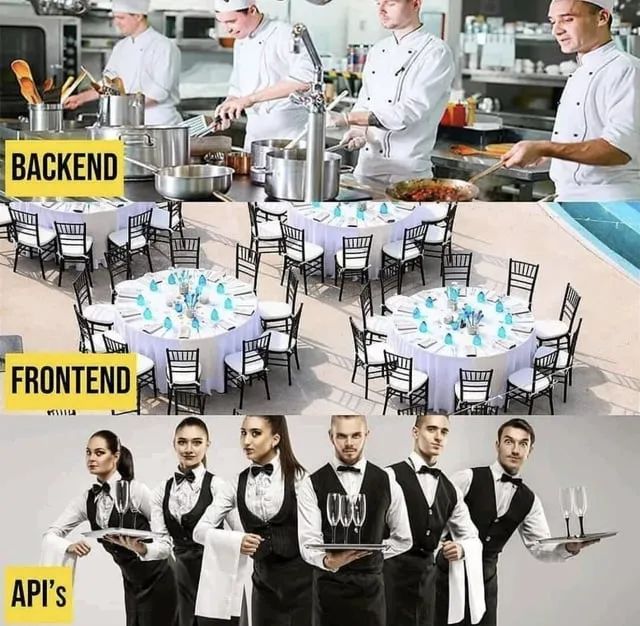
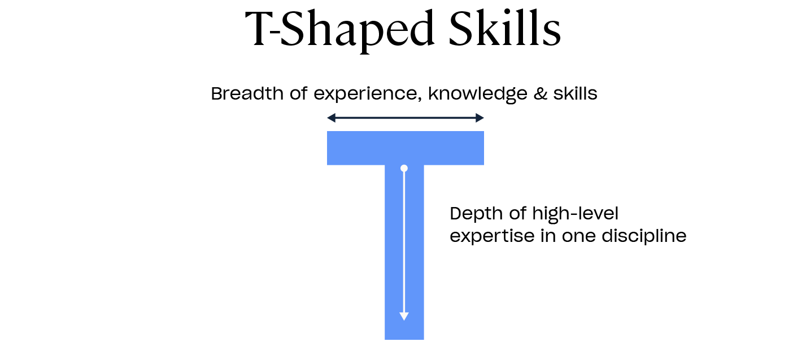

# Why Rails?


---
# Ancestry


- Did you know the DNA of humans and chimpanzees is ~98% the same?
<!-- Most of our DNA is the plumbing of being alive, being primates, etc. -->
- Only a *tiny* bit makes us distinct from chimpanzees.
- We have exactly the same 98% since we descended from a common ancestor, approximately 6-10 million years ago.

---
# Ancestry

- Similarly, **Twitter** and **Airbnb** share 98% of their code.
- Most SaaS applications have same core code:
    - web server
    - connecting to the database
    - rendering html
    - etc.
- Only a <small>tiny</small> bit makes them distinct
<!-- tweets instead of listings, etc. -->
- **Twitter** and **Airbnb** have exactly the same core code, since they share a common ancestor.

---
# History
- In 2003, a Chicago entrepreneur (Jason Fried) hired a Danish programmer (David Heinemeier Hansson) to build an idea he had for project management SaaS: **Basecamp**.
- David loved an obscure programming language called **Ruby**, which was invented in Japan in the mid 1990’s. Ruby was slow, but expressive and “beautiful” (to David).


---
# History
- Once he got Basecamp working, David extracted the 98% of it that was common plumbing for all SaaS and released it for free, open-source.
- He called this package of Ruby code that let you quickly get a web application up and running...**Ruby on Rails**.
- It was, at the time, revolutionary.

---
# Our hack

- Much like **Twitter**, **Airbnb**, **NYTimes**, **GitHub**, **Shopify** and thousands of other companies, we’re borrowing David’s (and, by now, thousands of other contributors’) code.
- This lets us skip re-inventing tens of thousands of lines of code and many years of learning.
- We stand on the shoulders of giants.


---

# Why Rails?
- Often asked why are we learning Ruby on Rails when there are countless options.
<!-- we haven't even placed anyone in a ruby/rails role yet -->

    - Optimize for programmer happiness
    - Convention over configuration
    - Integrated systems (full-stack)
    - one person framework
    - and more!

---

# Play the whole game
- The crucial piece in finally making programming “click” is learning all the skills needed to deploy an application, not just one or two pieces. (**full-stack**)
- Most courses or books teach you one language or skill, but then you’re left wondering how that fits in with the 99 other things you need to know in order to deploy an application.
- Making a real, functional application is motivating! It gives you a reason to continue learning — to improve it, and to make the next one.

---
# Play the whole game

- We call these full-stack applications "monoliths"
  - A whole system that addresses an entire problem.
- This means Rails is concerned with everything from the front-end JavaScript needed to make live updates to how the database is migrated from one version to another in production.



---



<!--
- We want to expose you to the full software development lifecycle

- That way you can come to an educated decision when deciding on a specific marketable skill to go deep on

-->

---

# Convention over configuration

- Decrease the number of decisions that a developer is required to make without losing flexibility
- As a beginner, this frees up mental "RAM" to focus on solving a problem.

---
# Convention over configuration

<!-- foreign key example -->
- We just learned about database "primary keys"
- Does it matter the format your database primary keys are described by?
- Does it really matter whether it’s “id”, “postId”, “posts_id”, or “pid”?
- As long as we agree to consistently use 1 format, this is not a decision that’s worthy of recurrent deliberation.

--- 

# Convention over configuration
<!-- TODO: routing example -->
- We just learned about routing in rails
- If you follow the rails "naming convention", you don't need to write as much code

```ruby
class PagesController
  def home
    # not needed, it automagically looks for this file in `views/pages/home`
    # based on controller (pages) and action (home) name
    render({ :template => "pages/home" })
  end
end
```

---

# Programmer Happiness

## The Principle of Least Surprise
```
$ irb
irb(main):001:0> exit
$ irb
irb(main):001:0> quit

$ python
>>> exit
Use exit() or Ctrl-D (i.e. EOF) to exit
```

- Ruby accepts both exit and quit
<!-- to accommodate the programmer’s obvious desire to quit its interactive console. -->
- Python pedantically instructs the programmer how to properly do what’s requested
<!-- even though it obviously knows what is meant since it’s displaying the error message -->

---
# Programmer Happiness

## Error Messages

- Ruby's error messages are typically clear and instructive.
- Remember to read the error messages! 

```bash
birthday_cake.rb:62:in `celebrate': undefined method `sign' for #<BirthdayCake:0x00000001034b9660 @age=10, @lit=false> (NoMethodError)

    puts birthday_cake.sign
                      ^^^^^
Did you mean?  sing
        from birthday_cake.rb:71:in `<main>'
```

<!-- 
Why Ruby
- Elegance and Readability
- Everything is an Object
- Interactive Shell (IRB)
- Strong Community and Resources
- Mature Frameworks
- Expressiveness
- Error Messages
- Garbage Collection
-->

---
# Rails Doctrine
- Many of the reasons are outlined in the "controversial" [Rails doctrine](https://rubyonrails.org/doctrine)

- https://rubyonrails.org/doctrine

<!-- Sign up for newsletters to stay updated -->

---

<!-- Simple expressive syntax -->


# Java

```java
public class HelloWorld { 
  public static void main(String[] args) {      
    System.out.println("Hello, World!"); 
  } 
}
```

To execute the Java program:
1. Save the code to a file named `HelloWorld.java`.
2. Compile it with the command: `javac HelloWorld.java`.
3. Run it with the command: `java HelloWorld`.

---

# Ruby

```ruby
puts "Hello, World!" 
```

To execute the Ruby program:
1. Save the code to a file named `hello_world.rb`.
2. Run it with the command: `ruby hello_world.rb`.

   
- As you can see, the Ruby version is much shorter due to its scripting nature and high level of abstraction. Java, on the other hand, requires a class definition and a main method to execute, which is typical for statically-typed, object-oriented languages. (edited) 


---
# Questions?


<!-- 
TODO:

[Choose Boring Technology](http://mcfunley.com/choose-boring-technology):

Let’s say every company gets about three innovation tokens. You can spend these however you want, but the supply is fixed for a long while. You might get a few more after you achieve a certain level of stability and maturity, but the general tendency is to overestimate the contents of your wallet. Clearly this model is approximate, but I think it helps.

If you choose to write your website in NodeJS, you just spent one of your innovation tokens. If you choose to use MongoDB, you just spent one of your innovation tokens. If you choose to use service discovery tech that’s existed for a year or less, you just spent one of your innovation tokens. If you choose to write your own database, oh god, you’re in trouble.

I believe Rails is this kind (the good kind) of “boring”.

A counterpoint: [Why I wouldn’t use Rails for a new company](https://blog.jaredfriedman.com/2015/09/15/why-i-wouldnt-use-rails-for-a-new-company/). The author’s basic thesis is to “skate where the puck is going” in terms of developer enthusiasm/mindshare, which makes sense.

However, I don’t believe that there is a clear successor to Rails – yet. The author mentions Node.js, but I believe that it has already stabilized in mindshare. Elm and Phoenix are both showing promise, but they still aren’t even close to having a rich ecosystem of “gems” and Stack Overflow answers like Rails has, so you will be spending some of your “innovation tokens” re-inventing things that the Rails community has already solved.

Here’s DHH himself on the topic: [What makes Rails a framework worth learning in 2017?](https://www.quora.com/What-makes-Rails-a-framework-worth-learning-in-2017/answer/David-Heinemeier-Hansson)


 -->


 <!-- 
  MVC Pattern
  -->


<!-- 
  Everything is an object
  -->


<!-- 
one person framework

https://world.hey.com/dhh/the-one-person-framework-711e6318

https://twitter.com/cantoniodasilva/status/1709857329267478913

 -->
